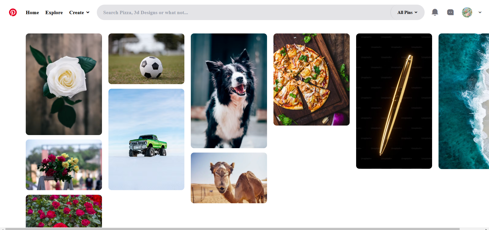

---

## 🌈 How It Works

1. **Search Bar**: The `input` element captures user input.
2. **Suggestions**: The JavaScript file listens to user input and matches it with predefined keywords or data.
3. **Images**: Based on matches, the script displays corresponding images as suggestions.

---

## 🖼️ Screenshot

Here’s a preview of the project in action:

---

## 🔧 Customization

- **Adding Images**: Add your images to the `images/` folder and update the JavaScript file to include them in the suggestion logic.
- **Styling**: Modify the `styles.css` file to customize the design.
- **Search Logic**: Update the `script.js` file to change the behavior of the search suggestions.

---

## 🌟 Future Improvements

- **API Integration**: Connect to an API to fetch dynamic search suggestions.
- **Search Categories**: Add category-based filtering.
- **Advanced Design**: Implement animations for better user experience.

---

## 🖤 Contributing

Feel free to fork the repository and submit pull requests for new features or improvements.

---

